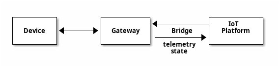

# IoT Gateway

IoT gateway is a device that connects its client devices to a IoT platforms.

```plantuml
@startditaa                                        
+--------+        +---------+           +----------+
|        |        |         +<----------+   IoT    |
| Device +<------>+ Gateway +   Bridge  | Platform | 
|        |        |         |---------->|          |
+--------+        +---------+ telemetry +----------+
                                state
@endditaa
```

